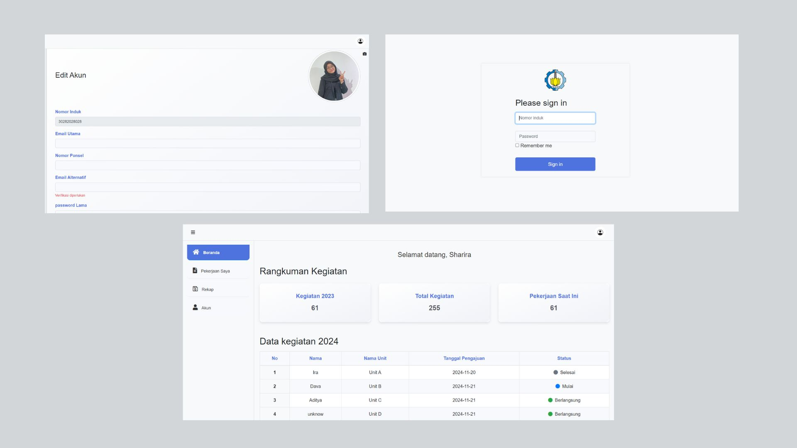

<h1> UKPBJ SITE ⚙️</h1>
<h2>Digital Solution for Job Data Management at UKPBJ ✨</h2>

The UKPBJ Site is an application designed to simplify the process of inputting data for each job by the Procurement Working Unit (UKPBJ). This application allows all documents to be stored online in a database, facilitating easy data search and management. Available features include:

**Key Features:**
* **Activity Summary:** Offers a detailed overview of completed activities, including year-over-year comparisons and current projects.
* **Employee Task Tracking:** Enables efficient monitoring of individual employee tasks and progress.
* **Data Reporting:** Generates customizable reports for comprehensive data analysis and decision-making.

**Technology Stack:**
* **Frontend:** HTML, CSS, JavaScript
* **UI/UX Design:** Figma

**Visual Example:**

**Benefits:**
* Improved project visibility and transparency.
* Enhanced team collaboration.
* Data-driven decision-making.

More information : [Presentation](https://www.canva.com/design/DAGGtWD3qHY/X5lWUtidvYo22Cxwru7s-Q/edit?utm_content=DAGGtWD3qHY&utm_campaign=designshare&utm_medium=link2&utm_source=sharebutton)

**Contact:**

* Email: Sharirasaniane95@gmail.com
* LinkedIn: [LinkedIn Sharira](https://www.linkedin.com/in/sharira-saniane/)